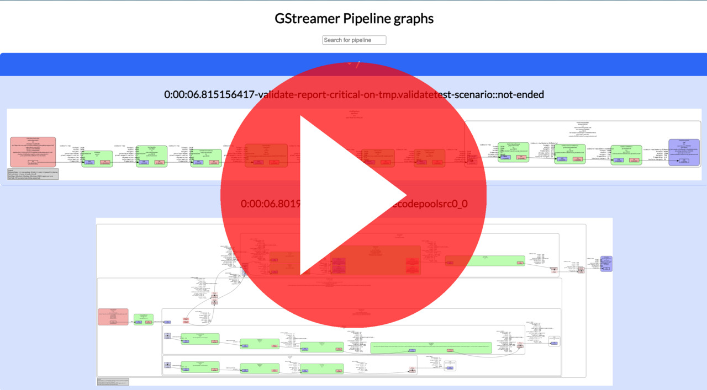

# gst-dots-viewer


Simple web server that watches a directory for GStreamer `*.dot` files in a local path and
serves them as a web page allowing you to browse them easily. See
`gst-dots-viewer --help` for more information.

## How to use it

This tool uses the `GST_DEBUG_DUMP_DOT_DIR` environment variable to locate the dot
files generated by GStreamer and defaults to `$XDG_CACHE_DIR/gstreamer-dots/` if it is not set.

You can run it with:

```sh
cargo run
```

Then you can open your browser at `http://localhost:3000` and wait for the graphs to appear as you use your
GStreamer application. The web page is updated every time a new `.dot` file is placed
in the path pointed by the folder watched by the `gst-dots-viewer` server.

## The `gstdump` utility

In order to simplify generating the dot files when developing GStreamer applications,
we provide the `gstdump` tool that can be used to **remove** old `.dot`
files and setup the [`pipeline-snapshot`](tracer-pipeline-snapshot) tracer with the following parameters:

- `xdg-cache=true`: Use the default 'cache' directory to store `.dot` files,
                  the same as what `gst-dots-viewer` uses by default
- `folder-mode=numbered`: Use folders to store the `.dot` files, with
                        incrementing number each time pipelines are dumped

If you have already configured the `pipeline-snapshot` tracer using the
`GST_TRACER` environment variable, `gstdump`  will not override it.

`gstdump` also sets `GST_DEBUG_DUMP_DOT_DIR` to the path where `gst-dots-viewer` expects them
so pipelines that are 'manually' dumped by the application are also dumped.

## Demo

Demo of the `gstdump`, gst-dots-viewer used in combination with the [tracer-pipeline-snapshot](tracer-pipeline-snapshot)

### Video:

[{width=70%}](https://youtu.be/-cHME_eNKbc "GStreamer dot files viewer")

### Start gst-dots

``` sh
# Starts the `gst-dots-viewer` server with default parameters
# You can open it in your browser at http://localhost:3000
$ gst-dots-viewer
```

### Start the GStreamer pipeline with `pipeline-snapshot` and `gstdump`


``` sh
# This runs the pipeline with `gstdump` which sets up:
#
# - the `pipeline-snapshot` tracer with the following parameters:
#   - xdg-cache=true: Use the default 'cache' directory to store `.dot` files,
#                     the same as what `gst-dots-viewer` uses by default
#   - folder-mode=numbered: Use folders to store the `.dot` files, with
#                           incrementing number each time pipelines are dumped
# - `GST_DEBUG_DUMP_DOT_DIR` path so pipelines that are 'manually' dumped by
#   `gst-launch-1.0` are also dumped.

gstdump gst-launch-1.0 videotestsrc ! webrtcsink run-signalling-server=true0
```

### Dump pipelines manually thanks to the `pipeline-snapshot` tracer

``` sh
kill -SIGUSR1 $(pgrep gst-launch-1.0)
```

Each time the pipeline is dumped, the `gst-dots-viewer` server will refresh
the page to display the new pipelines.
