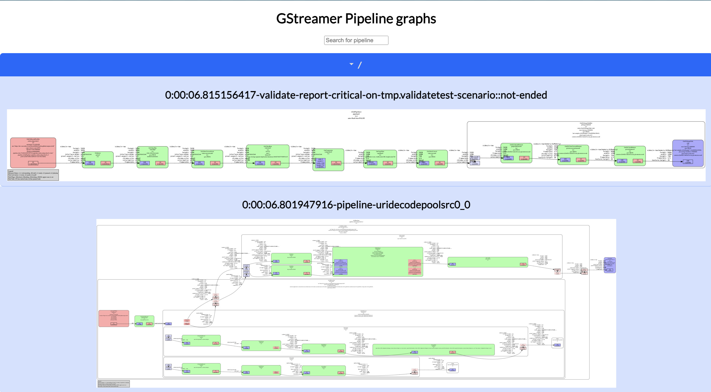

# gst-dots-viewer



Simple web server that watches a directory for GStreamer `*.dot` files in a
local path and serves them as a web page allowing you to browse them easily. See
`gst-dots-viewer --help` for more information.

## How to use it

This tool uses the `GST_DEBUG_DUMP_DOT_DIR` environment variable to locate the
dot files generated by GStreamer and defaults to
`$XDG_CACHE_DIR/gstreamer-dots/` if it is not set.

You can run it with:

```sh
cargo run
```

Or in development mode with:
```sh
cargo watch -x run
```

Then you can open your browser at `http://localhost:3000` and wait for the
graphs to appear as you use your GStreamer application. The web page is updated
every time a new `.dot` file is placed in the path pointed by the folder watched
by the `gst-dots-viewer` server.

## The `dots` tracer

In order to simplify generating the dot files when developing GStreamer
applications, we provide the `dots` tracer that can be used to **remove** old
`.dot` files and setup the [`pipeline-snapshot`](tracer-pipeline-snapshot)
tracer with the following parameters:

- `xdg-cache=true`: Use the default 'cache' directory to store `.dot` files, the
  same as what `gst-dots-viewer` uses by default
- `folder-mode=numbered`: Use folders to store the `.dot` files, with
  incrementing number each time pipelines are dumped

The `dots` tracer also sets `GST_DEBUG_DUMP_DOT_DIR` to the path where
`gst-dots-viewer` expects them so pipelines that are 'manually' dumped by the
application are also dumped.

## Demo

How to use the `dots` tracer, gst-dots-viewer used in combination with the
[tracer-pipeline-snapshot](tracer-pipeline-snapshot)

### Start gst-dots

```sh
# Starts the `gst-dots-viewer` server with default parameters
# You can open it in your browser at http://localhost:3000
$ gst-dots-viewer
```

### Start the GStreamer pipeline with `pipeline-snapshot` through the `dots` tracer

```sh
# This runs the pipeline with the `dots` tracer which sets up:
#
# - the `pipeline-snapshot` tracer with the following parameters:
#   - `dots-viewer-ws-url=ws://127.0.0.1:3000/snapshot/`: Sets the URL
#      of the default websocket server used by `gst-dots-viewer` so that the
#      pipelines can be dumped from the web interface.
#   - xdg-cache=true: Use the default 'cache' directory to store `.dot` files,
#                     the same as what `gst-dots-viewer` uses by default
#   - folder-mode=numbered: Use folders to store the `.dot` files, with
#                           incrementing number each time pipelines are dumped
# - `GST_DEBUG_DUMP_DOT_DIR` path so pipelines that are 'manually' dumped by
#   `gst-launch-1.0` are also dumped.

GST_TRACERS=dots gst-launch-1.0 videotestsrc ! webrtcsink run-signalling-server=true0
```

### Dump pipelines from the web interface

You can clock the "Dump Pipelines" button in the `gst-dots-viewer` web interface
to force
